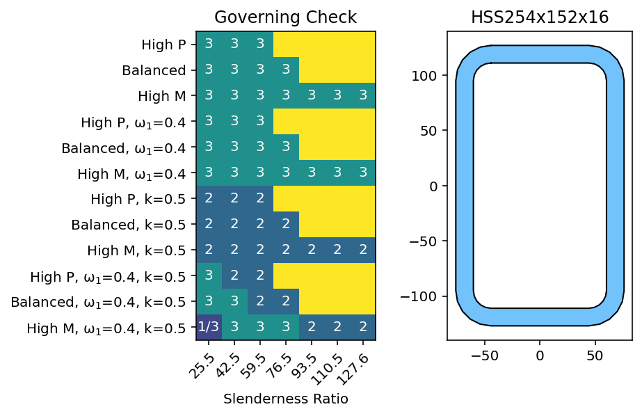
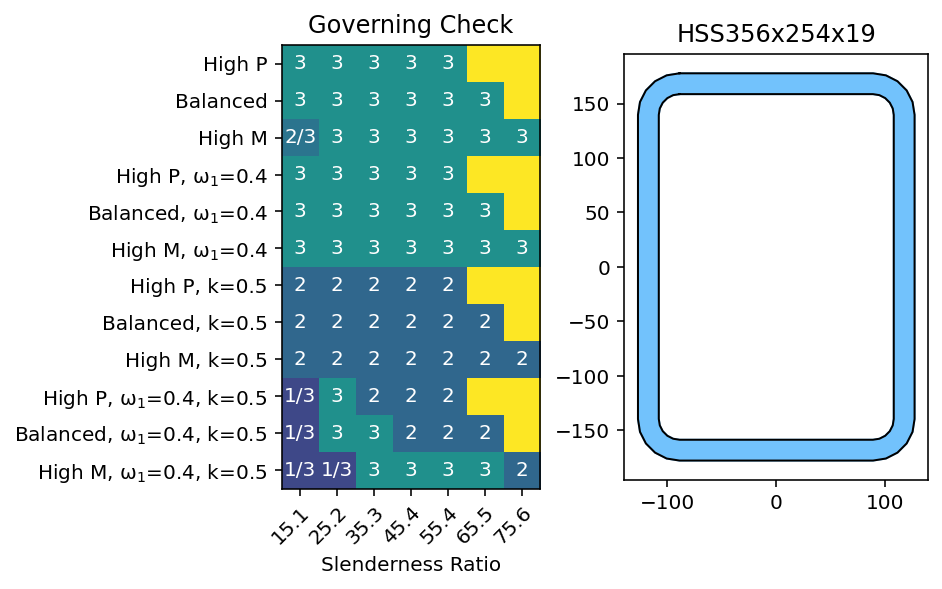

.. _examples-3.1a:
.. currentmodule:: limitstates

Beam-column Parametric Study
============================

Example Summary
----------------

In the following example, a parametric study is run on a series of CSA S16 steel beam-columns loaded in strong axis bending and compression. The goal of this study is to determine in what conditions each of the three compression moment interaction equations govern the strength of each beam-columns. 

In CSA, three conditions need to be checked when there is compression / moment interaction: cross sectional strength, overall member strength, and lateral torsional buckling strength. In cross sectional strength, the member is checked to ensure it's cross section does not fail at every point along the beam. In overall member strength, the member is checked to ensures that the total member does not fail compression. Lateral torsional buckling are neglected, but the buckling length is set to one. In lateral torsional buckling strength, the member is checked to ensure it doesn't buckle. A more detailed explanation of each check is given in the code commentaries, and example :ref:`examples-2.2.2.3a`.

A sample plot of the output is shown below.

Problem Setup
-------------------

Several sections are studied, using different HSS and W profiles. For each section chosen, a total of five input parameters were examined: compression force applied, strong axis moment applied, effective length, load distribution factor, and slenderness. 
The first two parameters were calculated by deterring the section's yield compressive strength (C\ :sub:`y`\) and braced moment resistance (M\ :sub:`y`\), then applying a factor to it. For each of the other parameters, three groups are run, with the following factors applied:

- High P, where C\ :sub:`f`\ = 0.8C\ :sub:`y`\, M\ :sub:`f`\= 0.2M\ :sub:`y`\
- Balanced, where C\ :sub:`f`\ = 0.5C\ :sub:`y`\, M\ :sub:`f`\= 0.5M\ :sub:`y`\
- High M, where C\ :sub:`f`\ = 0.2C\ :sub:`y`\, M\ :sub:`f`\= 0.8M\ :sub:`y`\

A total of four cases are considered for the other parameters:

1. The base case for the analysis is to take k = 1, and the load distribution factor, ω\ :sub:`1`\, is equal to as one. This represents a scenario where moments are always increased for PM interaction, and no interior member bracing is used.
2. In the second group, ω\ :sub:`1`\=0.4. This represents the best case scenario, where there is a high moment gradient. For low values of slenderness, case 2/3 can have their moments reduced.
3. In the third group, there is assumed to be buckling restraint at k=0.5. This affects case 3 the most, as the lengths for lateral torsional buckling will be reduced.
4. In the fourth group, both k=0.5 and ω\ :sub:`1`\=0.4.

Finally, in each analysis group, the effect of slenderness is examined by increasing the sections length from 3m to 15m in increments of 2m. All the above inputs are checked assuming the column is in a braced frame.

Code Overview
--------------------
 
First the necessary libraries and functions are imported. There are two helper functions used in a separate file; one that runs the analysis, and one that makes the plots.  Both functions use basic implementations of limitstates and matplotlib. A set of inputs are then defined, and the chosen sections are iterated through. Where two cases have the same utilization, both cases are shown, i.e. 1/3 in a cell means case 1 and 3 are tied. Where the applied load has exceeded the buckling capacity of the column, cells are coloured yellow.

.. literalinclude:: ../../../../example/3. Advanced Concepts/Ex 3.1a - Steel PM Interaction - Parametric Study.py
   :lines: 7-62

.. literalinclude:: ../../../../example/3. Advanced Concepts/parametricHelpers.py
   :lines: 26-74

.. literalinclude:: ../../../../example/3. Advanced Concepts/parametricHelpers.py
   :lines: 75-149

Results
----------

Each plot is shown below. There are a few results immediately noticeable, the biggest being that case 1 did not govern any of the sections alone. This makes sense, case 2 and case 3 will have lower compression or bending resistance than case 1 due to slenderness considerations. Because Case 3 takes 1 <= U1x except when there is negative bending, Case 1 can only govern if there is a high moment gradient, and negative bending.

For W sections, Case 3 almost always governed - the notable exception being where k=0.5 occasionally case 2 governs in squat sections. This also matches expectations, as W sections will have a low torsional stiffness. Sections that are tall generally more prone to buckling around their weak axis, while in squat the difference between Ix and Iy is smaller. Squat sections also have a larger torsional stiffness porportional to their axial / bending resistance.

For HSS sections, rectangular sections are governed by case 3, except where k=0.5. This is likely because in uniaxial bending, case 2 only checks buckling of the column in it's strong axis. For square sections case 2/3 have similar capacities. This also matches expectation, as the strong and weak axis compression strength will be the same. HSS members were more likely to fail in pure compression.

In all sections, those that started with high compression resistance were more likely to exceed the buckling force at high slenderness values.

Closing Thoughts
----------------------

Based on the observed outcomes and explaination given above, if there is only positive bending and no intermediate bracing, case 3 will govern W sections and HSS Sections. Members with intermediate bracing are more likely to be governed by case 2, but only if they have a relatively high torsion resistance, or similar comrpession resistance in both it's strong / weak direction.

