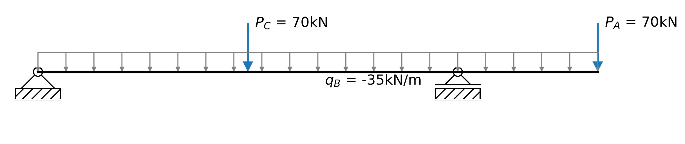
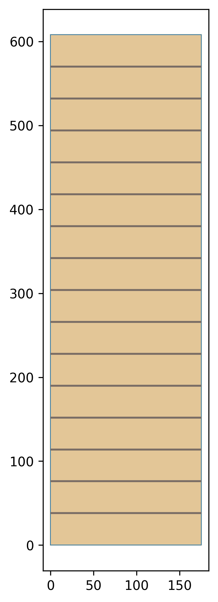

.. _examples-2.2.1.4:

Glulam Beam Multispan Design Example
====================================

This example shows how a multi-span glulam beam can be checked for Moment.
In CSA o86, multi-span beams are required to have a kL for each segment between support points, and a different kzbg for each portion of the BMD between inflection points. The beam we are assessing is a 175x608 20f-E glulam beam a shown below, where the length between supports is 6m and the cantilever is 2m long. We'll assume the beam is laterally supported through it's top flange in the first span, and unsupported for it's cantilever.

   
The first step is to import all the necessary libraries, and defile some variables for the problem. This example requires the library planesections is installed, which we will use to analyze the beam. We will also use numpy for some small data analysis tasks.
 
.. literalinclude:: ../../../../example/2. Design/2.2 CSA/2.2.1 - o86/Ex 2.2.1.4 - Glulam Multi-Span Beam.py
   :lines: 9-13, 20-23

We'll define the section and material properties as usual
 
.. literalinclude:: ../../../../example/2. Design/2.2 CSA/2.2.1 - o86/Ex 2.2.1.4 - Glulam Multi-Span Beam.py
   :lines: 25-26

Because the beam is multi-span, we need to use a custom beam support. We can do so using objects from the limistates :ref:`geometry <objects-geometry>` library.
 
.. literalinclude:: ../../../../example/2. Design/2.2 CSA/2.2.1 - o86/Ex 2.2.1.4 - Glulam Multi-Span Beam.py
   :lines: 35-44

From here defining the beam is similar to usual, however, we will set some properties related to the span. Table 7.4 is used to determine the unbraced span lengths. We'll plot the section once we're done with it.
 
.. literalinclude:: ../../../../example/2. Design/2.2 CSA/2.2.1 - o86/Ex 2.2.1.4 - Glulam Multi-Span Beam.py
   :lines: 47-53

To analyze the beam, we'll convert it to a planesections beam object, then apply our loading. A convert function in limistates can be used to directly transfer our beam over. We'll also create a figure of the beam diagram.
 
.. literalinclude:: ../../../../example/2. Design/2.2 CSA/2.2.1 - o86/Ex 2.2.1.4 - Glulam Multi-Span Beam.py
   :lines: 59-65

We run the analysis as usual using planesections.
 
.. literalinclude:: ../../../../example/2. Design/2.2 CSA/2.2.1 - o86/Ex 2.2.1.4 - Glulam Multi-Span Beam.py
   :lines: 70-71

We them make some output plots to make sure we're happy with the results, get the bending moment diagram, and convert it to a limistates diagram object.
 
.. literalinclude:: ../../../../example/2. Design/2.2 CSA/2.2.1 - o86/Ex 2.2.1.4 - Glulam Multi-Span Beam.py
   :lines: 77-84

We'll check the Moment and shear for our beam. The simplified function :py:func:`~limitstates.design.csa.o86.c19.glulam.checkVrGlulamBeamSimple` will assume the beam is laterally supported over it's whole length, and used here as a reference upper bound on strength.

.. literalinclude:: ../../../../example/2. Design/2.2 CSA/2.2.1 - o86/Ex 2.2.1.4 - Glulam Multi-Span Beam.py
   :lines: 86-87

Finally, we check the moment for the multi-span beam. The results are broken up per section.

.. literalinclude:: ../../../../example/2. Design/2.2 CSA/2.2.1 - o86/Ex 2.2.1.4 - Glulam Multi-Span Beam.py
   :lines: 91-91

 The whole design example is as below:
 
.. literalinclude:: ../../../../example/2. Design/2.2 CSA/2.2.1 - o86/Ex 2.2.1.4 - Glulam Multi-Span Beam.py
