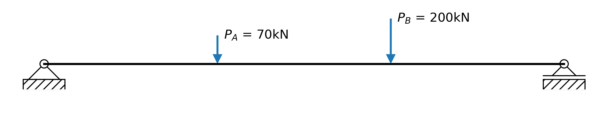

.. _examples-2.2.2.1:

Steel Beam Design Example
=========================

This example shows how a simply supported W530x72 steel element can be checked for 
moment when the beam is laterally supported, or unsupported.  A 6m long beam is analyzed with two point loads as shown bellow. A plot of the beam analyzed is output as part of this example. The beam is assessed in three conditions: continuous lateral support is provided to the beam, the beam is unsupported and loaded on it's top flange, and the loaded at it's shear center.

   

   
The capacity of the section is determined by limitstates, and compared to forces from an analyzed beam using the planesections library. First the base limitstates library is imported, then s16 steel design library for 2024. The library planesections is imported to run the beam analysis.

 
.. literalinclude:: ../../../../example/2. Design/2.2 CSA/2.2.2 - s16/Ex 2.2.2.1 - Basic Beam Design.py
   :lines: 20-23

Next the beam is created. First a material with 345MPa steel is set up using a design specific material, :py:class:`~limitstates.design.csa.s16.c24.material.MaterialSteelCsa24` , and the W530x72 section is loaded from the aisc library, using si units using  :py:func:`~limitstates.objects.read.getSteelSections`. 
 
.. literalinclude:: ../../../../example/2. Design/2.2 CSA/2.2.2 - s16/Ex 2.2.2.1 - Basic Beam Design.py
   :lines: 30-36

A simply supported member is then initialized, and the design properties of the beam are set. For the unsupported loading condition, it's assumed that forces are applied to the top chord, and the simplied method of analysis will be used. Therefor, in this design the factors ω = 1, and kx = 1.2 is used. To achieve the longer unsupported length, a custom design property objects  :py:class:`~limitstates.design.csa.s16.c24.element.DesignPropsSteel24` is set with kx = 1.2. This length applies to the strong axis of the beam. The beam is simply supported so the typical member initiation function can be used, :py:func:`~limitstates.objects.geometry.initSimplySupportedMember`. 

 
.. literalinclude:: ../../../../example/2. Design/2.2 CSA/2.2.2 - s16/Ex 2.2.2.1 - Basic Beam Design.py
   :lines: 44-46

The capacity of the beam is determined assuming it has continous lateral support (c.l. 13.5), and no lateral support (c.l. 13.6) with :py:func:`~limitstates.design.csa.s16.c24.beamColumn.checkBeamMrSupported`, and :py:func:`~limitstates.design.csa.s16.c24.beamColumn.checkBeamMrUnsupported`. 

 
.. literalinclude:: ../../../../example/2. Design/2.2 CSA/2.2.2 - s16/Ex 2.2.2.1 - Basic Beam Design.py
   :lines: 52-53

To analyze the beam, it is converted convert it to a planesections beam object, then apply our loading. A converter function in limistates can be used to directly transfer our beam over to planesections. A plot  is also create a figure of the beam diagram. Refer to planesections documentation to see how to analyze an arbitrary beam.
 
.. literalinclude:: ../../../../example/2. Design/2.2 CSA/2.2.2 - s16/Ex 2.2.2.1 - Basic Beam Design.py
   :lines: 62-82

The strength of the beam is then determined assuming it's loaded at it's shear center. This would be the case if purlins were framing into the side of the beam, and the loading was balanced, i.e. there was a purlin on either side of the beam. 

The simplified method is no longer being used, so another beam is created which used the original beam length. The omega value of the beam can be determined based on omega from the bending moment diagram class :py:class:`~limitstates.analysis.data.DesignDiagram` is used to determine omega.

 
.. literalinclude:: ../../../../example/2. Design/2.2 CSA/2.2.2 - s16/Ex 2.2.2.1 - Basic Beam Design.py
   :lines: 91-99

Based on this analysis, it can be see: 
    - If the beam is laterally supported, it's capacity is 472kNm and  passes easily. 
    - If the beam is laterally unsupported and loaded on it's top flange, it's cpacity is 181kNm and it fails by a large margin
    - If the beam is laterally unsupported and loaded at it's shear center, it's capacity is 315kNm and it barely passes.

Lateral support conditions are important and significantly influence beam strength!

The full example is below:

 
.. literalinclude:: ../../../../example/2. Design/2.2 CSA/2.2.2 - s16/Ex 2.2.2.1 - Basic Beam Design.py
