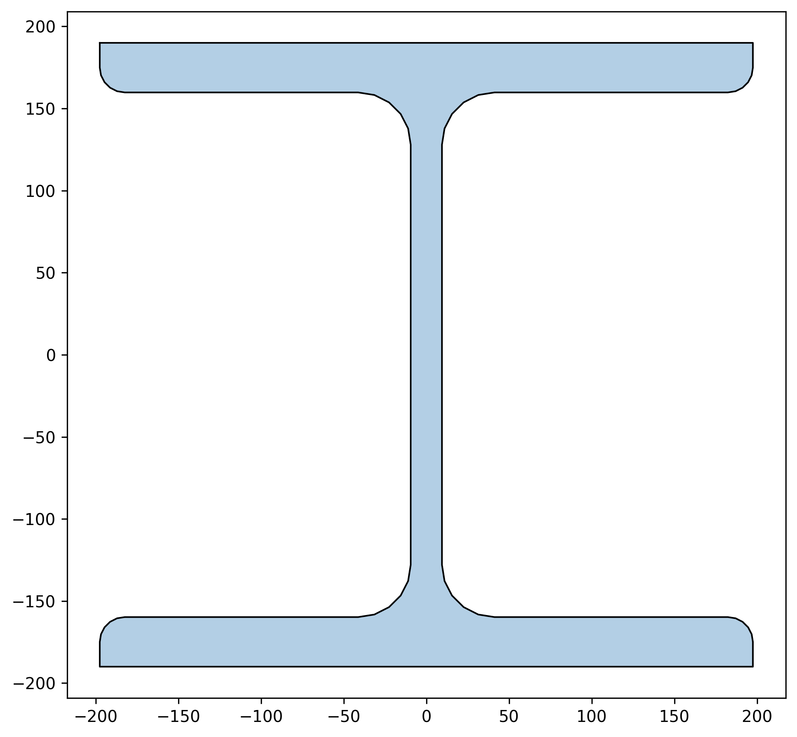

.. _examples-2.2.2.3a:

Steel Beam-column Design, W
=============================

This example shows how a W beamcolumn can be checked for moment / compression interaction.

A W360x237 section in a braced frame is checked for combined 
bending / compression. It's assumed that:
    - The element is 6m tall
    - Cf = 4400kN
    - Mf = 500kNm at the top
    - Mf = 400kNm at the bottom, (double curvature bending)
    - ASTM steel is used with My = 345MPa
    - P-Delta effects have been included in the analysis.

The example is broken into two parts. In the first part the combined bending is checked. In the second part, a break down and explaination of each part of the check is given, showing how results can be calcualted manually, and giving an explanation on the code clauses used in each.

   
First the base library is imported, along wtih the CSA s16-24 steel library. First a material with 345MPa steel is set up using a design specific material, :py:class:`~limitstates.design.csa.s16.c24.material.MaterialSteelCsa24` , and the W360x237 section is loaded from the aisc library, using si units using  :py:func:`~limitstates.objects.read.getSteelSections`. 
Note, if the beam was in positive curvature, then the moments would have opposite signs.    

 
.. literalinclude:: ../../../../example/2. Design/2.2 CSA/2.2.2 - s16/Ex 2.2.2.3a - P-M Interaction - W section.py
   :lines: 31-41

Next the beam is created, default support conditions are used.
 
.. literalinclude:: ../../../../example/2. Design/2.2 CSA/2.2.2 - s16/Ex 2.2.2.3a - P-M Interaction - W section.py
   :lines: 47-48

The user inputs the loading condition. In this case, there are no intermediate loads, so loading condition 1 is used. The four load cases for combined loading is then checked using :py:func:`~limitstates.design.csa.s16.c24.beamColumn.checkBeamColumnCombined` - it's that easy! 
 
.. literalinclude:: ../../../../example/2. Design/2.2 CSA/2.2.2 - s16/Ex 2.2.2.3a - P-M Interaction - W section.py
   :lines: 57-60

While the user will often default to using the checkBeamColumnCombined, for educational purposes it will be shown how to determine each of the four checks run on the beamcolumn. 

The first check is total section strength, which looks at the strength of elements without any stability checks (13.8.2 a). This check ensures that the cross section can withstand forces applied to it at any point on the beam, and as such reducing omega factors are not considered.
The supported member strength is calculated, and the member strength is calculatd with lambda = 0. This means that buckling is not considered, and the compression strength is equal the sections gross yield strength.

The euler buckling capacity for the element is calculated, this will be used later in equations. U1x is also calculated given the load factor (omega1x) that was calculated earlier.
 
.. literalinclude:: ../../../../example/2. Design/2.2 CSA/2.2.2 - s16/Ex 2.2.2.3a - P-M Interaction - W section.py
   :lines: 82-88
   

limitstates also has a function to calculate u1 combined. 
 
.. literalinclude:: ../../../../example/2. Design/2.2 CSA/2.2.2 - s16/Ex 2.2.2.3a - P-M Interaction - W section.py
   :lines: 93-93 
   
   

The second case, B, is used to assess the overal member strength, which can be thought of as the members "primary" axis bending strength. The in-plane strength of the member is checked alone in the axis of bending. This check will govern for large members that have intermediate lateral bracing which prevents torsion, but do not prevent bending.

Some notes; because buckling is considered in case B, the compression resistance Crb will always be smaller than check Cra. However, the moment utilization can be smaller than check A, because the term U1 will account for moment gradient.

In this case, U1x is taken as 1 because the system is a brace frame. CSA S16 sets U1x = 1 because P-delta effects are considered to be small in sway frames, where the peak moment normally occurs at column.

In limitstates, in-plane behaviour is forced by artificially modifying the stiffness k factor. 

.. literalinclude:: ../../../../example/2. Design/2.2 CSA/2.2.2 - s16/Ex 2.2.2.3a - P-M Interaction - W section.py
   :lines: 115-129

limitstates also has a function to calculate u2 combined. 
 
.. literalinclude:: ../../../../example/2. Design/2.2 CSA/2.2.2 - s16/Ex 2.2.2.3a - P-M Interaction - W section.py
   :lines: 134-134 
   

The next check is lateral torsional buckling. For beams that aren't braced, this check will almost always govern. The member is allowed to buckle in lateral torsion, and the unsupported member strength is used for bending.

 
.. literalinclude:: ../../../../example/2. Design/2.2 CSA/2.2.2 - s16/Ex 2.2.2.3a - P-M Interaction - W section.py
   :lines: 143-149

The final check is biaxial bending, which will be neglected because the member only has bending in one axis. The full example is below:

 
.. literalinclude:: ../../../../example/2. Design/2.2 CSA/2.2.2 - s16/Ex 2.2.2.3a - P-M Interaction - W section.py

